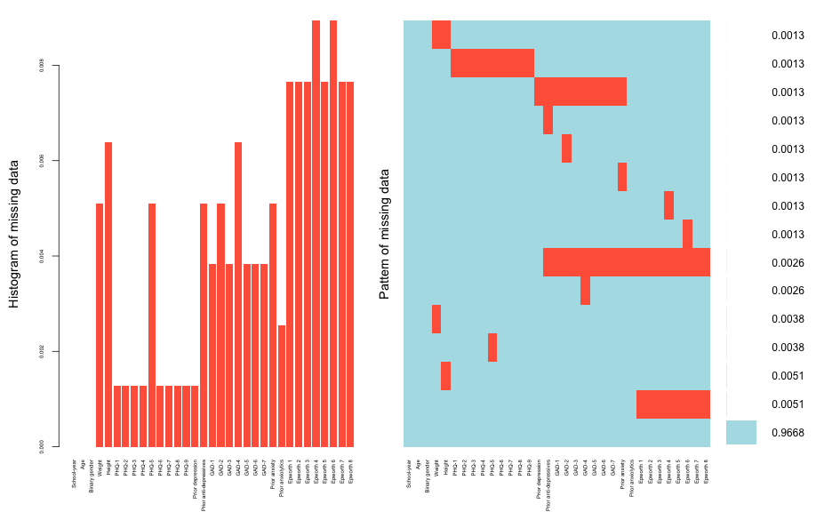
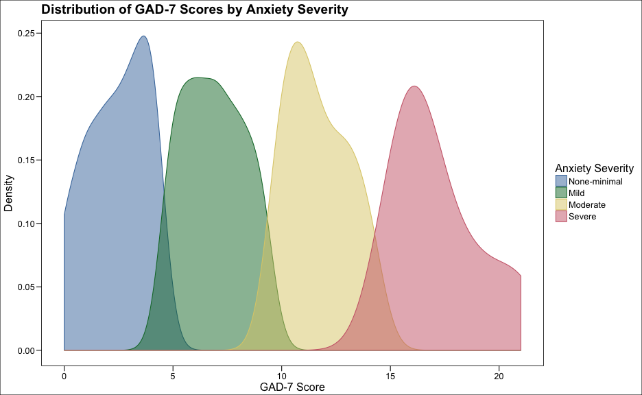

## Background

Overweight and obesity have become a major global health challenge. According to the World Health Organiztion (WHO), adults with a body mass index (BMI) ranging from 25 to 30 are considered as overweight, and those with a BMI above 30 are considered as as obese. Amid the OECD member countries, Mexico has become one with the highest prevalence in adult population, with 38.8% and 32.4% respectively. (OECD, 2015).

The prevalence of mental health disorders has also increased importantly, contributing significantly to the burden of disease (WHO-AIMS Regional Report on Mental Health Systems in Latin America and the Caribbean. Washington DC: PAHO, 2013), 40.5% of this burden is attributable to clinical depression (J Am Acad Child Adolesc Psychiatry 2015,54(1):37-44). Anxiety is another mental health disorder that frecuently co-occurs with depression (), even showing a high genetic correlation. Both of these entities are associated with a substantial functional and cognitive impaiment, representing 4.19% of the total Disability-Adjusted Years (DALYs) in Mexico. 

Young adults have the greatest prevalence of mental disorders, and are increasing in overweight and obesity rates. These health issues acquire more relevance, since only 18-34% of young people -with overweight, obesity or depression/anxiety symptoms- seek for professional help, and only 20-25% of those diagnosed, are receiving appropriate treatment. 

Medical students are susceptible to a higher risk of depression,() anxiety and bad dietary habits, and are less likely to receive treatment. Previous studies have shown that medical students experience a higher rate of mental illness than general population, and that obesity is a problem among the medical population and health personnel. 

The aim of our study is to asses the relationship of depressive and anxiety disorders with overweight and obesity in a young Mexican population. 

The aim of our study is to asses the relationship of BMI to the presence of depression and anxiety in a young Mexican population 

Explain the scientific background and rationale for the investigation being reported

## Objectives

We hypothesize that a higher body-mass index is positively correlated to the presence of depression and anxiety. We tested the null hypothesis that   

If we could reject the null hypothesis, this study would strengthen the available evidence stating that overweight and obesity are correlated to depression and anxiety. 

Testh bot, the hypothesis and the null hypothesis to strenght the available evidence stating that overweight and obesity are correlated to depression and anxiety. 

# Methods

* Describe the study participants or what was studied (e.g., patient population, cell lines; be as specific as possible, including numbers of individuals studied). Describe the study design, intervention if applicable, main methods used, primary outcome measure(s), and length of follow up if applicable.

* [If appropriate, include how many participants were assessed out of those enrolled. For survey research, include the response rate.]

* [If critical to the understanding of the paper, describe how results were analyzed, i.e., which specific statistical tests were used.]

* Describe the main outcomes and quantify the results using a measure of precision (e.g., 95% confidence interval). Describe any adverse events.

* Describe the main limitations of the study.

Describe statistical methods with enough detail to enable a knowledgeable reader with access to the original data to judge its appropriateness for the study and to verify the reported results. When possible, quantify findings and present them with appropriate indicators of measurement error or uncertainty (such as confidence intervals). Avoid relying solely on statistical hypothesis testing, such as P values, which fail to convey important information about effect size and precision of estimates. References for the design of the study and statistical methods should be to standard works when possible (with pages stated). Define statistical terms, abbreviations, and most symbols. Specify the statistical software package(s) and versions used. Distinguish prespecified from exploratory analyses, including subgroup analyses.

## Ethics Statement 

## Study design

During winter of 2013, we designed a cross-sectional observational study to be conducted in the campus of Universidad Autónoma de Guadalajara, a big Mexican private university.

## Setting

Describe the setting, locations, and relevant dates, including periods of recruitment, exposure, follow-up, and data collection

## Participants

Give the eligibility criteria, and the sources and methods of selection of participants

## Variables

Clearly define all outcomes, exposures, predictors, potential confounders, and effect modifiers. Give diagnostic criteria, if applicable

## Data sources and measurement

For each variable of interest, give sources of data and details of methods of assessment (measurement). Describe comparability of assessment methods if there is more than one group

## Bias

Describe any efforts to address potential sources of bias.

### Response Bias
Response bias is a general term for a wide range of cognitive biases that influence the responses of participants away from an accurate or truthful response (from (Wikipedia)[https://en.wikipedia.org/wiki/Response_bias#History_of_research])

### Survivorship bias 
Survivorship bias, or survival bias, is the logical error of concentrating on the people or things that "survived" some process and inadvertently overlooking those that did not because of their lack of visibility. This can lead to false conclusions in several different ways. The survivors may be actual people, as in a medical study, or could be companies or research subjects or applicants for a job, or anything that must make it past some selection process to be considered further (from (Wikipedia)[https://en.wikipedia.org/wiki/Survivorship_bias])

## Study size

Explain how the study size was arrived at 1376 

## Quantitative variables

Explain how quantitative variables were handled in the analyses. If applicable, describe which groupings were chosen and why

## Statistical methods

For observational studies, authors are required to clearly specify (a) What specific hypotheses the researchers intended to test, and the analytical methods by which they planned to test them; (b) What analyses they actually performed; and (c) When reported analyses differ from those that were planned, authors must provide transparent explanations for differences that affect the reliability of the study's results

(a) Describe all statistical methods, including those used to control for confounding

(b) Describe any methods used to examine subgroups and interactions

(c) Explain how missing data were addressed

(d)Cross-sectional study—If applicable, describe analytical methods taking account of sampling strategy

(e) Describe any sensitivity analyses

(f) Technical details of the analysis

# Results

During fall 2014, we collected mental health data and sociodemographic survey data from Medical students enrolled at Universidad Autónoma de Guadalajara —a large private university that offers one of the oldest Medical School programmes in the country. 

We randomly selected 1200 Medical students out of ~3000 enrolled at the time, and stratified this target population by school year, weighting the subsampling process according to the size of each stratum, which made the subsample size of proportional to the subpopulation size. We got a population (see Table 1)

The Results section should include all primary and secondary outcome measures analyzed. The section may be divided into subsections, each with a concise subheading. Tables and figures central to the study should be included in the main paper. The Results section should be written in past tense.

PLOS journals require authors to make all data underlying the findings described in their manuscript fully available without restriction, with rare exception.

Large data sets, including raw data, may be deposited in an appropriate public repository. [See our list of recommended repositories.](http://journals.plos.org/plosmedicine/s/data-availability#loc-recommended-repositories)

For smaller data sets and certain data types, authors may provide their data within [Supporting Information files ](http://journals.plos.org/plosmedicine/s/supporting-information)accompanying the manuscript. Authors should take care to maximize the accessibility and reusability of the data by selecting a file format from which data can be efficiently extracted (for example, spreadsheets or flat files should be provided rather than PDFs when providing tabulated data).

*Give numeric results not only as derivatives (for example, percentages) but also as the absolute numbers from which the derivatives were calculated, and specify the statistical significance attached to them, if any. Restrict tables and figures to those needed to explain the argument of the paper and to assess supporting data. Use graphs as an alternative to tables with many entries; do not duplicate data in graphs and tables. Avoid nontechnical uses of technical terms in statistics, such as "random" (which implies a randomizing device), “normal,” “significant,” “correlations,” and “sample.”*

## Participants

(a) Report numbers of individuals at each stage of study—eg numbers potentially eligible, examined for eligibility, confirmed eligible, included in the study, completing follow-up, and analysed

(b) Give reasons for non-participation at each stage

(c) Consider use of a flow diagram

## Descriptive data

(a) Give characteristics of study participants (eg demographic, clinical, social) and information on exposures and potential confounders

(b) Indicate number of participants with missing data for each variable of interest

## Depressive disorders data

## Anxiety disorders data

## Main results

(a) Give unadjusted estimates and, if applicable, confounder-adjusted estimates and their precision (eg, 95% confidence interval). Make clear which confounders were adjusted for and why they were included

(b) Report category boundaries when continuous variables were categorized

(c) If relevant, consider translating estimates of relative risk into absolute risk for a meaningful time period

## Other analyses

Report other analyses done—eg analyses of subgroups and interactions, and sensitivity analyses

# Conclusions

* Provide a general interpretation of the results with any important recommendations for future research.

* [For a clinical trial, provide any trial identification number(s) and name(s) (e.g., trial registration number, protocol number or acronym).]

